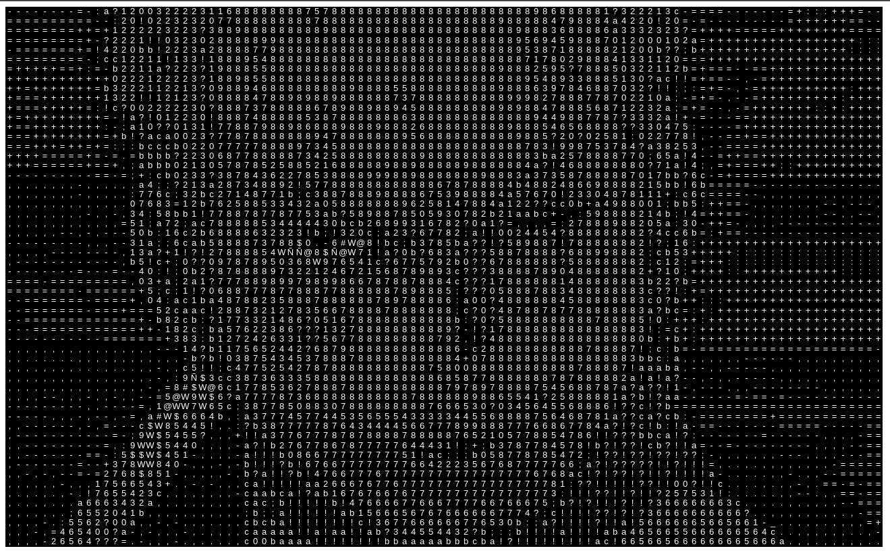
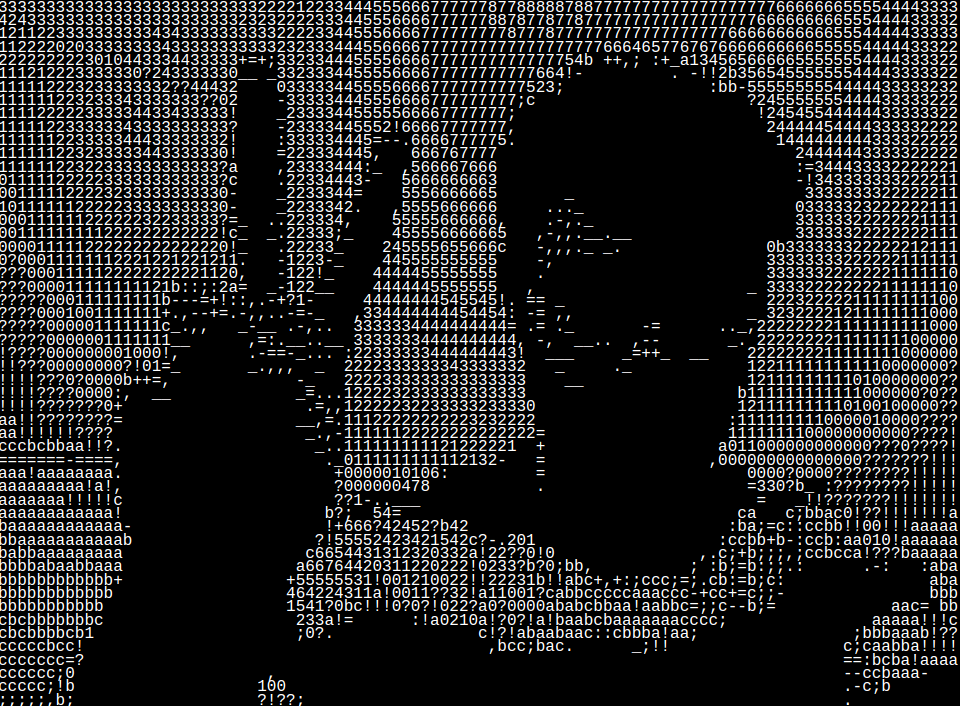

# **ASCIIM - Image to ASCII Text Converter**

<!--markdownlint-disable MD033-->

ASCIIM is a simple yet powerful tool that converts images into ASCII text. This project was developed while following tutorials from Coding Train, leveraging the concepts and techniques demonstrated in those videos.

## **Example**

### **Static image**

Here's a quick glimpse of what ASCIIM can do:

 

ASCIIM can convert low-resolution images into ASCII text by taking the grayscale value of each pixel and mapping it to a character. The darker the pixel, the more characters are used to represent it.

### **Front-facing camera**

ASCIIM can also convert live video from your front-facing camera:

Following the same process, ASCIIM converts each frame of the video into ASCII text. The result is a live ASCII video feed.

## **References**

This project was inspired by and developed while following Coding Train tutorials.

[Coding Challenge 166](https://www.youtube.com/watch?v=55iwMYv8tGI)
